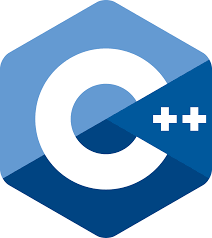
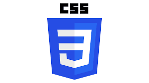
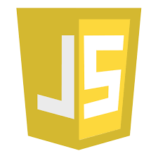
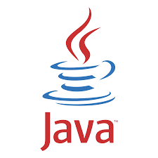
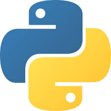

# About this repository

## Project usage

- Resources and projects for new developers to practice essential skills.
- An interactive introduction to software development for beginners.

## What I have done

I have created many files in different languages with some errors and it is up to **YOU** to *fix* them! :sunglasses:

---

# How can you contribute?

1. Pick a coding language that you like from the curated list I created.
2. Search in *issues* for that respective language's issue.
3. Choose any issue from the *many* exercises there in that programming language.
4. Read the issue description *throughly* so that you understand it *properly*.
5. Fork the repository and choose a brief name that you like, or let it remain the same (which I recommend :smile:).
6. Edit the respective file in the forked repository and send the corrected file with a message explaining what you changed in the file.
7. Send a pull request to me and I will check it.
8. **YOU ARE DONE!!** :smile:

---

# Coding languages

| **Language** | **Usage** | **Logo** | **Boilerplate code?** |
|---|---|---|
| C++ | C++ is a high-performance, object-oriented language used for building operating systems, game engines, and resource-intensive software requiring direct memory control. |  | Yes |
| HTML | HTML is the standard markup language used to structure and display content on the World Wide Web using elements like tags and attributes. |  | Yes |
| CSS | CSS is a stylesheet language used to control the visual presentation, layout, and design of web pages written in HTML. |  | No, not necessary in a seperate CSS file |
| JavaScript | JavaScript is a high-level, interpreted scripting language used to create interactive and dynamic content on websites and power full-stack applications. |  | No, not necessary in a seperate JS file |
| Java | Java is a versatile, object-oriented language used for building enterprise-grade applications, Android mobile apps, and large-scale backend systems. |  | Yes |
| Python | Python is a versatile, high-level language used for data science, web development, and automation due to its simple, readable syntax. |  | No |

# Boilerplate code for each language (if needed)

## C++

```cpp
#include <iostream>

int main() {
  // Your code here
  return 0;
}
```

## HTML

```html
<!DOCTYPE html>
<html>
  <head>
    <!-- Your code here -->
  </head>
  <body>
    <!-- Your code here -->
  </body>
</html>
```

## Java

```java
public class Main {
    public static void main(String[] args) {
        // Your code here
    }
}
```

# Errors

If you find any errors on my side, please feel free to share them so I can fix the errors.
